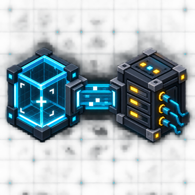
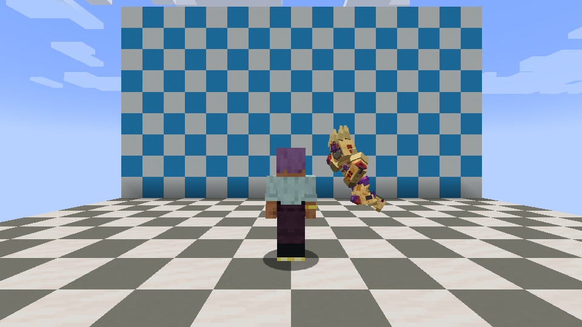

# MineClient Bridge



MineClient Bridge is a client-side NeoForge 1.21.1 mod that exposes an authenticated HTTP interface on the local loopback address. External tools can inspect the active Minecraft client, capture its current framebuffer, and operate configured keys and GUI controls without moving the user's desktop cursor.

The repository also includes an optional MCP server and a reusable Codex skill for isolated client acceptance workflows. MineClient Bridge is independent of any gameplay mod.

## Supported Environment

- Minecraft 1.21.1
- NeoForge 21.1.197 or newer within the 21.1 line
- Java 21
- Client installation only; no server installation is required

The mod itself has no gameplay-mod dependency. The optional prepared-root launcher in the bundled MCP currently targets Windows because it launches clients on native background desktops. Direct HTTP clients can use the mod without the MCP.

## Capabilities

- Read bridge and client session status.
- Capture the presented framebuffer as PNG without writing a screenshot first.
- Inspect configured key mappings and held state.
- Inspect bounded player, world, inventory, effect, crosshair, weather, nearby-entity, GUI-widget, and container-slot state.
- Press, release, or tap a named Minecraft `KeyMapping`, or send an internal keyboard event for keys such as Enter, Escape, and F1.
- Change player view, send normal in-world mouse buttons and scroll through Minecraft's native mouse callback, operate GUI pointer controls, and submit bounded text through the active screen.
- Submit a Minecraft command directly without opening the chat screen.
- Release all held mappings and request a graceful client shutdown.

MineClient Bridge does not expose arbitrary shell commands, scripts, filesystem operations, or direct world-edit endpoints. Its input endpoints can still trigger normal gameplay and GUI actions, just as a player can.

## Security And Privacy

- The HTTP server binds to `127.0.0.1` by default and rejects non-loopback callers again on every request.
- Every `/control/*` request requires `Authorization: Bearer <token>`.
- A 256-bit token is generated with `SecureRandom`, stored in `config/mineclient-bridge.token`, restricted to the current owner where the platform supports it, and never logged.
- `config/mineclient-bridge.json` contains only `enabled`, `host`, and `port`.
- Request bodies, JSON responses, framebuffer PNGs, queries, GUI entries, and text input all have fixed upper bounds.
- Text and command input reject control characters and enforce fixed length limits.
- Authorized command input uses Minecraft's normal client command path; the connected server still decides command permissions.
- Held mappings are released when the bridge or client stops.
- The mod contains no telemetry and sends no data to an external service.

Any local program that receives the token can operate the exposed client actions. Do not publish or share the token. See [SECURITY.md](SECURITY.md) for the threat model and reporting instructions.

## Installation

1. Install NeoForge for Minecraft 1.21.1.
2. Place `mineclient-bridge-neoforge-1.21.1-1.1.2.jar` in the client's `mods` directory.
3. Start the client. The mod creates its config and token files on first launch.
4. Connect an authorized loopback client to `http://127.0.0.1:38121` using the generated token.

The bridge is enabled by default. Set `"enabled": false` in `config/mineclient-bridge.json` to turn it off. The host is always constrained to loopback. Runtime overrides are available through `mineclientBridge.*` system properties or `MINECLIENT_BRIDGE_*` environment variables for `enabled`, `host`, `port`, and `token`.

## HTTP Endpoints

`GET /control/status`, `GET /control/capabilities`, `GET /control/frame`, `GET /control/keymaps`, `GET /control/state`, `GET /control/screen`, `POST /control/key`, `POST /control/raw-key`, `POST /control/look`, `POST /control/mouse`, `POST /control/text`, `POST /control/command`, `POST /control/release-all`, and `POST /control/close`.

All Minecraft state reads and input changes are dispatched to the client main thread. Named mapping taps activate only the requested `KeyMapping`, including an unbound mapping, rather than every mapping that shares its physical key. World mouse buttons use Minecraft's native `MouseHandler` callback so NeoForge and gameplay-mod input events receive the same press/release sequence as a real client mouse; world scroll passes through NeoForge's mouse-scroll event before normal hotbar behavior. `POST /control/command` accepts up to 256 command characters with or without a leading slash. `POST /control/text` keeps normal chat-screen behavior, so submitted slash-prefixed text is handled as a command by Minecraft. Raw keys are delivered through Minecraft's own `KeyboardHandler`; the bridge never injects operating-system input. Raw-key and world-mouse `down` and `up` actions are idempotent. A `click` on a held input completes that press; otherwise it sends a new press/release pair, so every click ends released and repeated clicks remain independent. Release-all, close, and bridge shutdown emit native releases for every tracked raw key and world mouse button, including when a screen opened while a world button was held.

## MCP And Codex Integration

The optional MCP server lives in [`mcp/`](mcp/). It exposes seven `minecraft_client_*` tools for launch/register, status, framebuffer capture, structured queries, bounded input, and exact-session shutdown. See [mcp/README.md](mcp/README.md) for installation and its Windows prepared-root contract.

The reusable skill at [`integrations/codex/minecraft-client-acceptance`](integrations/codex/minecraft-client-acceptance) describes evidence-based client testing and disjoint multi-agent background-client batches.

## Live Client Verification



This is a real 960x540 framebuffer from the NeoForge 1.21.1 smoke session. The gameplay model belongs to a separate compatibility-test mod; MineClient Bridge adds no in-game overlay. In the same session the MCP verified exact process/desktop/root identity, queried client state and 46 key mappings, captured PNG pixels, exercised view and `key.sneak` press/release, cleared held input, and confirmed exact PID and background Desktop cleanup. The machine-readable summary is in [`docs/evidence/1.0.0-client-smoke.json`](docs/evidence/1.0.0-client-smoke.json).

## Build And Test

```powershell
.\gradlew.bat clean build
node .\mcp\self-test.mjs
```

The release artifact is `build/libs/mineclient-bridge-neoforge-1.21.1-1.1.2.jar`.

## License And References

MineClient Bridge is licensed under the [MIT License](LICENSE). MCPFabric and DebugBridge were consulted as design references only; no source, assets, or binaries from either project are included. See [THIRD_PARTY_REFERENCES.md](THIRD_PARTY_REFERENCES.md).

The project avatar is an original AI-assisted illustration and does not depict a separate in-game UI.
